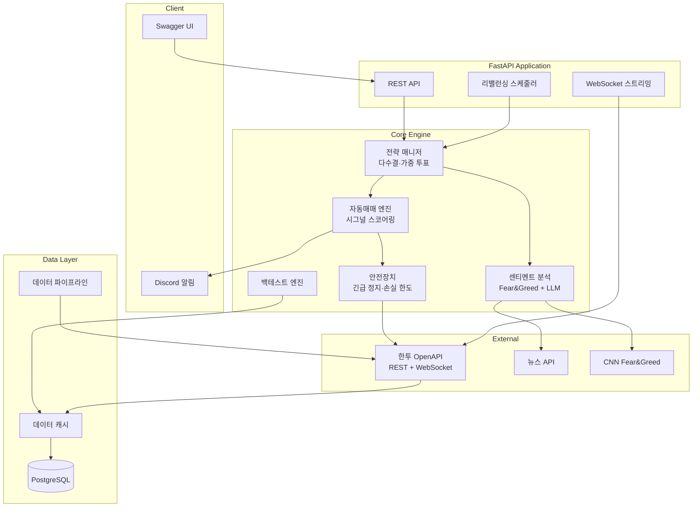

# Market Auto Trader 📈

[](https://github.com/lunara-kim/market-auto-trader/actions/workflows/ci.yml)


[](https://github.com/lunara-kim/market-auto-trader)

> 🌍 [English README](README_EN.md)

> **⚠️ 본 소프트웨어는 교육·연구 목적입니다. 투자 손실은 사용자 본인 책임이며, 과거 백테스트 수익률이 미래 수익을 보장하지 않습니다. → [면책 조항 전문](DISCLAIMER.md)**

한국투자증권 OpenAPI 기반 **풀스택 자동매매 프레임워크**입니다.

---

## 💡 왜 이 프로젝트?

기존 한투 API 오픈소스(python-kis, mojito, pykis)는 대부분 **API 래퍼**입니다. 시세 조회와 주문 실행은 되지만, 전략 엔진·백테스팅·리스크 관리·모니터링은 직접 구현해야 합니다.

**market-auto-trader**는 API 래퍼가 아닌, 매매 전략부터 운영까지 갖춘 **프로덕션 레벨 프레임워크**입니다.

| 기능 | API 래퍼 (python-kis 등) | market-auto-trader |
|------|:-:|:-:|
| 시세 조회 / 주문 실행 | ✅ | ✅ |
| 복합 전략 매니저 (다수결·가중 투표) | ❌ | ✅ |
| 백테스팅 (수수료·세금·MDD·샤프비율) | ❌ | ✅ |
| AI 센티멘트 분석 (Fear&Greed + LLM 뉴스) | ❌ | ✅ |
| 자동 리밸런싱 + 스케줄러 | ❌ | ✅ |
| WebSocket 실시간 시세 + Discord 알림 | ❌ | ✅ |
| 안전장치 (긴급 정지·일일 손실 한도) | ❌ | ✅ |
| 971 테스트 + CI/CD | ❌ | ✅ |

---

## ✨ 주요 기능

- 🤖 **AI 센티멘트 분석** — CNN Fear & Greed Index + LLM 뉴스 감성 분석
- 📊 **백테스트 엔진** — 히스토리컬 센티멘트·PER·PEG ratio 기반 전략 검증
- 🔄 **자동매매 엔진** — 시그널 스코어링 + 트레일링 스톱 + 자동 리밸런싱
- 🌏 **국내/해외 주식** — 한투 OpenAPI (REST + WebSocket)
- 🛡️ **안전장치** — 긴급 정지, 일일 손실 한도, 포지션 사이징
- 📈 **시장 프로필** — 성장주(PEG), 가치주(PER), ETF 등 섹터별 전략 프로필
- 📣 **실시간 알림** — Discord 웹훅으로 매매·손절·급등급락 알림

---

## 🚀 Quick Start

```bash
# 1. 클론
git clone https://github.com/lunara-kim/market-auto-trader.git
cd market-auto-trader

# 2. 환경 변수 설정
cp .env.example .env   # 한투 API 키 등 입력

# 3. Docker로 실행
docker compose up -d

# 4. API 확인
open http://localhost:8000/docs   # Swagger UI
```

> 로컬 개발 모드는 [설치 가이드](#-설치-및-실행)를 참고하세요.

---

## 🏗️ 아키텍처



---

## 📊 API 엔드포인트

| 엔드포인트 | 메서드 | 설명 |
|-----------|--------|------|
| `/health` | GET | 기본 헬스체크 |
| `/api/v1/health/detailed` | GET | 상세 헬스체크 (DB, API 상태) |
| `/api/v1/orders` | POST/GET | 주문 실행 및 내역 조회 |
| `/api/v1/portfolio` | GET | 포트폴리오 현황 |
| `/api/v1/signals` | POST | 매매 신호 생성 |
| `/api/v1/strategies/*` | GET/POST | 전략 목록·신호·비교 |
| `/api/v1/alerts` | CRUD | 알림 규칙 관리 |
| `/api/v1/rebalancing` | POST/GET | 리밸런싱 실행/내역 |
| `/api/v1/dashboard` | GET | PnL 대시보드 |
| `/api/v1/streaming` | WebSocket | 실시간 시세 |
| `/api/v1/data-pipeline` | POST/GET | 데이터 수집/상태 |
| `/api/v1/reports` | GET | 거래 리포트 |
| `/api/v1/sentiment/*` | GET | 센티멘트 분석 |
| `/api/v1/auto-trader/*` | POST/GET | 자동매매 엔진 제어 |
| `/api/v1/safety/*` | GET/POST | 안전장치 상태/긴급 정지 |
| `/api/v1/backtest/*` | POST | 백테스트 실행 |

> 전체 API 문서: `http://localhost:8000/docs` (Swagger UI)

---

## 🛠 기술 스택

| 영역 | 기술 |
|------|------|
| Backend | Python 3.13, FastAPI, Pydantic v2 |
| Database | PostgreSQL, SQLAlchemy 2.0, Alembic |
| Trading API | 한국투자증권 OpenAPI (REST + WebSocket) |
| AI/ML | LLM 뉴스 감성분석, CNN Fear & Greed Index |
| Testing | pytest (971 tests), pytest-asyncio |
| Lint | ruff |
| Infra | Docker, Docker Compose, GitHub Actions CI |

---

## 🔧 설치 및 실행

### Docker (권장)

```bash
git clone https://github.com/lunara-kim/market-auto-trader.git
cd market-auto-trader
cp .env.example .env   # API 키 설정
docker compose up -d
```

### 로컬 개발

```bash
python3.13 -m venv .venv
source .venv/bin/activate
pip install -r requirements.txt

alembic upgrade head                                    # DB 마이그레이션
uvicorn src.main:app --reload --host 0.0.0.0 --port 8000  # 실행
```

### 테스트

```bash
python -m pytest -q          # 전체 테스트 (971개)
python -m pytest --tb=short  # 실패 시 상세 출력
```

---

## 📝 개발 로드맵

- [x] **Phase 1** — 기초 인프라 (Docker, CI/CD, DB, 한투 API 클라이언트)
- [x] **Phase 2** — 전략 + API (이동평균, 백테스팅, 포트폴리오, 리스크 관리)
- [x] **Phase 3** — 고도화 (RSI, 볼린저밴드, 복합 전략, 리밸런싱, WebSocket, 알림, 센티멘트)
- [ ] **Phase 4** — 프로덕션 준비 (React 대시보드, 모의투자 연동, Prometheus + Grafana)

---

## 🤝 기여하기

이슈와 PR을 환영합니다!

1. Fork → Branch (`feature/my-feature`) → Commit → Push → PR
2. 코드 스타일: `ruff check` 통과 필수
3. 테스트: 새 기능에는 테스트를 함께 작성해 주세요

> 버그 리포트, 기능 제안은 [Issues](https://github.com/lunara-kim/market-auto-trader/issues)에 남겨주세요.

---

## 📄 라이선스

[Apache License 2.0](LICENSE)
