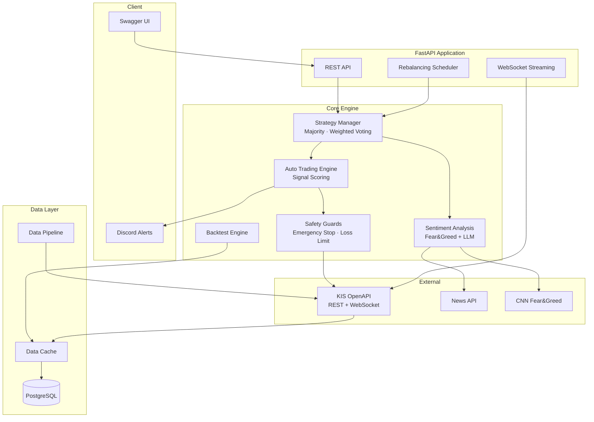

# Market Auto Trader 📈

[](https://github.com/lunara-kim/market-auto-trader/actions/workflows/ci.yml)


[](https://github.com/lunara-kim/market-auto-trader)

> 🇰🇷 [한국어 README](README.md)

> **⚠️ This software is for educational and research purposes only. Investment losses are the user's sole responsibility. Past backtest performance does not guarantee future returns. → [Full Disclaimer](DISCLAIMER.md)**

A **production-grade automated trading framework** built on Korea Investment & Securities OpenAPI.

---

## 💡 Why This Project?

Existing Korean stock trading open-source projects (python-kis, mojito, pykis) are mostly **API wrappers** — they handle quotes and order execution, but you're on your own for strategy engines, backtesting, risk management, and monitoring.

**market-auto-trader** is not a wrapper. It's a **full-stack framework** from trading strategies to operations.

| Feature | API Wrappers (python-kis, etc.) | market-auto-trader |
|---------|:-:|:-:|
| Quotes / Order Execution | ✅ | ✅ |
| Composite Strategy Manager (voting) | ❌ | ✅ |
| Backtesting (fees, taxes, MDD, Sharpe) | ❌ | ✅ |
| AI Sentiment (Fear&Greed + LLM News) | ❌ | ✅ |
| Auto Rebalancing + Scheduler | ❌ | ✅ |
| WebSocket Real-time + Discord Alerts | ❌ | ✅ |
| Safety (Emergency Stop, Daily Loss Limit) | ❌ | ✅ |
| 971 Tests + CI/CD | ❌ | ✅ |

---

## ✨ Key Features

- 🤖 **AI Sentiment Analysis** — CNN Fear & Greed Index + LLM-powered news sentiment
- 📊 **Backtest Engine** — Historical sentiment, PER, PEG ratio-based strategy validation
- 🔄 **Auto Trading Engine** — Signal scoring + trailing stop + auto rebalancing
- 🌏 **Korean & Global Stocks** — Korea Investment OpenAPI (REST + WebSocket)
- 🛡️ **Safety Guards** — Emergency stop, daily loss limit, position sizing
- 📈 **Market Profiles** — Growth (PEG), value (PER), ETF sector-specific strategies
- 📣 **Real-time Alerts** — Discord webhook for trades, stop-loss, unusual activity

---

## 🚀 Quick Start

```bash
# 1. Clone
git clone https://github.com/lunara-kim/market-auto-trader.git
cd market-auto-trader

# 2. Configure
cp .env.example .env   # Set your KIS API keys

# 3. Run with Docker
docker compose up -d

# 4. Explore the API
open http://localhost:8000/docs   # Swagger UI
```

---

## 🏗️ Architecture



---

## 🛠 Tech Stack

| Area | Technology |
|------|-----------|
| Backend | Python 3.13, FastAPI, Pydantic v2 |
| Database | PostgreSQL, SQLAlchemy 2.0, Alembic |
| Trading API | Korea Investment & Securities OpenAPI (REST + WebSocket) |
| AI/ML | LLM News Sentiment, CNN Fear & Greed Index |
| Testing | pytest (971 tests), pytest-asyncio |
| Lint | ruff |
| Infra | Docker, Docker Compose, GitHub Actions CI |

---

## 🔧 Installation

### Docker (Recommended)

```bash
git clone https://github.com/lunara-kim/market-auto-trader.git
cd market-auto-trader
cp .env.example .env   # Configure API keys
docker compose up -d
```

### Local Development

```bash
python3.13 -m venv .venv
source .venv/bin/activate
pip install -r requirements.txt

alembic upgrade head
uvicorn src.main:app --reload --host 0.0.0.0 --port 8000
```

### Tests

```bash
python -m pytest -q          # 971 tests
python -m pytest --tb=short  # Verbose on failure
```

---

## 📝 Roadmap

- [x] **Phase 1** — Infrastructure (Docker, CI/CD, DB, KIS API client)
- [x] **Phase 2** — Strategies + API (Moving Average, Backtesting, Portfolio, Risk)
- [x] **Phase 3** — Advanced (RSI, Bollinger Bands, Composite Strategy, Rebalancing, WebSocket, Alerts, Sentiment)
- [ ] **Phase 4** — Production (React Dashboard, Paper Trading, Prometheus + Grafana)

---

## 🤝 Contributing

Issues and PRs are welcome!

1. Fork → Branch (`feature/my-feature`) → Commit → Push → PR
2. Code style: must pass `ruff check`
3. Tests: please include tests for new features

---

## 📄 License

[Apache License 2.0](LICENSE)
